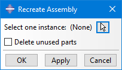

# Abaqus Plugin: Recreate Assembly
Plugin for Abaqus/CAE to quickly recreate the Part-Instance relationship

 
More details:

Imported assemblies into Abaqus/CAE often lose their part-instance relationship. In this case every instance is converted to a separate part. From that, a single instance of every part is created in the assembly. That means for example, instead of having one bolt with 16 instances, we now have 16 bolt with one instance each. This structure prevents us from using the benefits of part-level partitioning and meshing. And in case of a bolt also from applying bolt loads at part-level.

My Plug-In tries to fix this issue by doing a kind of geometrical search. The users selects an instance in the Plug-In UI. From that it detects the corresponding part and then compares all other parts against it. If geometrically identical parts are found, it replaces all instances of those parts with instances of the initial part.

The attached short video shows that on a simple example. Be aware of the color coding based on the criteria “Parts”. Every instance from a different part gets a different color. That also means, that all instances of the same part get the same color. The effect of my Plug-In will become directly visible in the colors.

 

Usage at your own risk.